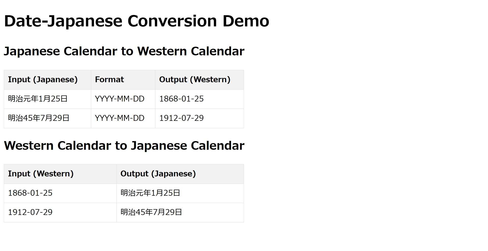

# date-japanese

Convert Japanese calendar dates to Western calendar dates and vice versa. Full support for Kanji numerals in Wareki dates.

## Installation

```bash
npm install --save date-japanese
```

## Quick Start

### Node.js

```js
const {toWesternCalendar, toJapaneseCalendar} = require('date-japanese');

toWesternCalendar('令和4年2月21日', 'YYYY-MM-DD'); // -> 2022-02-21
toJapaneseCalendar('2022-02-21'); // -> 令和4年2月21日
```

Or in ES6 syntax:

```js
import {toWesternCalendar, toJapaneseCalendar} from 'date-japanese';

toWesternCalendar('令和4年2月21日', 'YYYY-MM-DD'); // -> 2022-02-21
toJapaneseCalendar('2022-02-21'); // -> 令和4年2月21日
```

### Browser

```html
<script src="node_modules/date-japanese/dist/build.js"></script>
<script>
  dateJapanese.toWesternCalendar('令和4年2月21日', 'YYYY-MM-DD'); // -> 2022-02-21
  dateJapanese.toJapaneseCalendar('2022-02-21'); // -> 令和4年2月21日
</script>
```

Or in ES6 syntax:

```html
<script type="module">
  import {toWesternCalendar, toJapaneseCalendar} from 'node_modules/date-japanese/dist/build.mjs';

  toWesternCalendar('令和4年2月21日', 'YYYY-MM-DD'); // -> 2022-02-21
  toJapaneseCalendar('2022-02-21'); // -> 令和4年2月21日
</script>
```

## API

### `toWesternCalendar(japaneseDate, format, throwOnInvalid)`

Converts a Japanese calendar date to a Western calendar date in the specified format. Supported eras: Meiji (明治), Taisho (大正), Showa (昭和), Heisei (平成), Reiwa (令和).

**Parameters:**

* `japaneseDate`: Japanese calendar date (e.g., '令和4年2月20日', '令和4年2月', '令和4年').
* `format`: Output date format. Available tokens: YYYY, YY, M, MM, MMM, MMMM, D, DD (default: 'YYYY-MM-DD').
* `throwOnInvalid`: If `true`, throws an error if the input date is invalid. If `false`, returns an empty string (default: `false`).

**Return value:**

The Western calendar date in the specified format, or an empty string if the input is invalid and `throwOnInvalid` is `false`.

**Examples:**

```js
toWesternCalendar('令和元年5月1日'); // -> 2019-05-01
toWesternCalendar('令和4年2月21日', 'YYYY/MM/DD'); // -> 2022/02/21
toWesternCalendar('平成元年1月', 'YYYY-MM'); // -> 1989-01
```

### `toJapaneseCalendar(westernDate)`

Converts a Western calendar date to a Japanese calendar date.
This function only supports dates from 1868-01-25 onwards (Meiji era and later).

**Parameters:**

* `westernDate`: Western calendar date in one of the following formats: 'YYYY-MM-DD', 'YYYY-M-D', 'YYYY/MM/DD', 'YYYY/M/D', 'MM-DD-YYYY', 'M-D-YYYY', 'MM/DD/YYYY', 'M/D/YYYY', 'YYYY-MM', 'YYYY-M', 'YYYY/MM', 'YYYY/M', 'MM-YYYY', 'M-YYYY', 'MM/YYYY', 'M/YYYY', 'YYYY'.
* `throwOnInvalid`: If `true`, throws an error if the input date is invalid. If `false`, returns an empty string (default: `false`).

**Return value:**
The Japanese calendar date, or an empty string if the input date is before the Meiji era or invalid (and `throwOnInvalid` is `false`).

**Examples:**

```js
toJapaneseCalendar('2019-05-01'); // -> 令和元年5月1日
toJapaneseCalendar('2022-02-21'); // -> 令和4年2月21日
toJapaneseCalendar('1989-02'); // -> 平成元年2月
```

### `isValidJapaneseCalendar(value)`

Checks if the given value is a valid Japanese calendar date.

**Parameters:**

* `value`: The value to be validated.

**Return value:**

`true` if the value is a valid Japanese calendar date, `false` otherwise.

**Examples:**

```js
isValidJapaneseCalendar('令和元年5月1日'); // -> true
isValidJapaneseCalendar('令和4年2月21日'); // -> true
isValidJapaneseCalendar('2022-02-21'); // -> false
```

## Demos

This package includes demos for various environments:

* **Browser Demo:** [demo/browser/index.html](demo/browser/index.html)
    * See the screenshot below for a preview.
* **Node.js (CommonJS):** [cjs/index.cjs](cjs/index.js)
* **Node.js (ES Modules):** [esm/index.js](esm/index.js)

### Browser Demo Screenshot



<!-- 
## Prototypes

### `prototypes/run_japanese_calendar.mjs`

```bash
node prototypes/run_japanese_calendar.mjs -d 2025-01-30 # -> Western Calendar: 2025-01-30, Japanese Calendar: 令和7年1月30日
node prototypes/run_japanese_calendar.mjs -d 2025/1/30 # -> Western Calendar: 2025/1/30, Japanese Calendar: 令和7年1月30日
node prototypes/run_japanese_calendar.mjs -d 2025-01 # -> Western Calendar: 2025-01, Japanese Calendar: 令和7年1月
node prototypes/run_japanese_calendar.mjs -d 2025/1 # -> Western Calendar: 2025/1, Japanese Calendar: 令和7年1月
node prototypes/run_japanese_calendar.mjs -d 2025 # -> Western Calendar: 2025, Japanese Calendar: 令和7年
``` -->

## Testing

```bash
npm test
```

## Release Notes

All changes can be found [here](CHANGELOG.md).

## Author

**Takuya Motoshima**

* [github/takuya-motoshima](https://github.com/takuya-motoshima)
* [twitter/TakuyaMotoshima](https://twitter.com/TakuyaMotoshima)
* [facebook/takuya.motoshima.7](https://www.facebook.com/takuya.motoshima.7)

## License

[MIT](LICENSE)